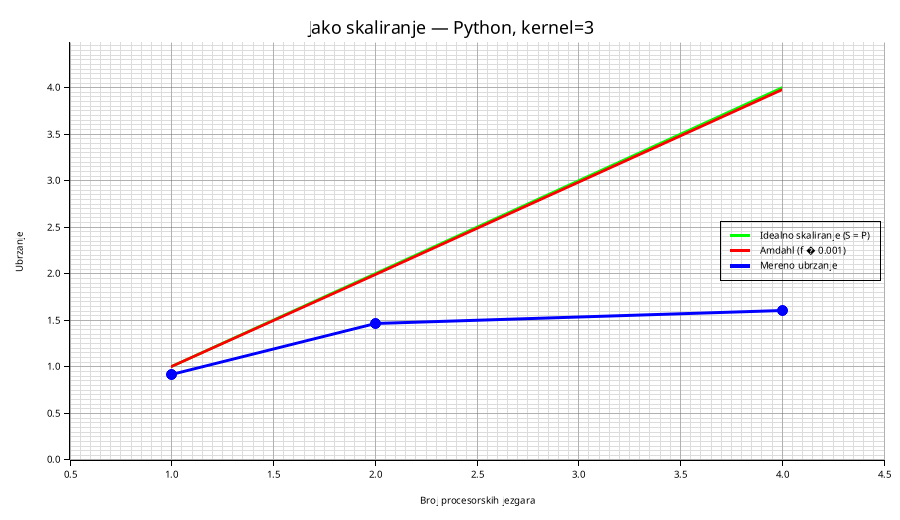
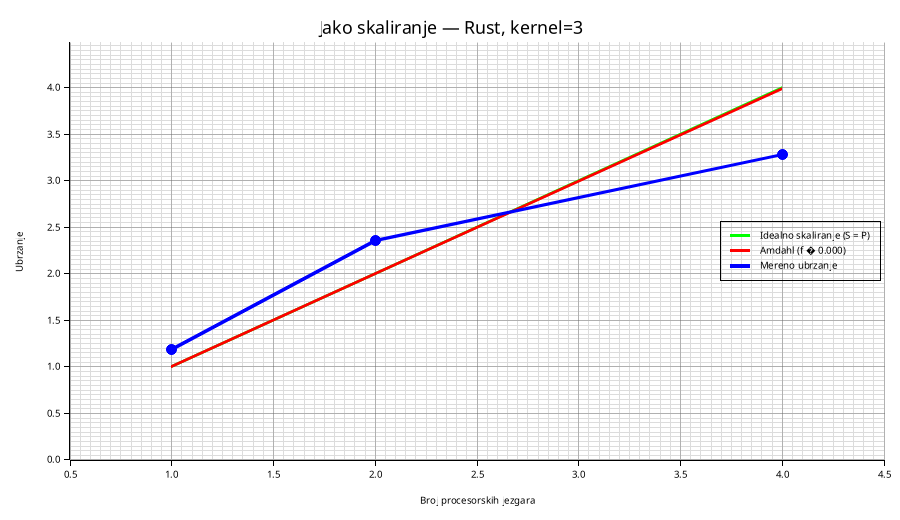
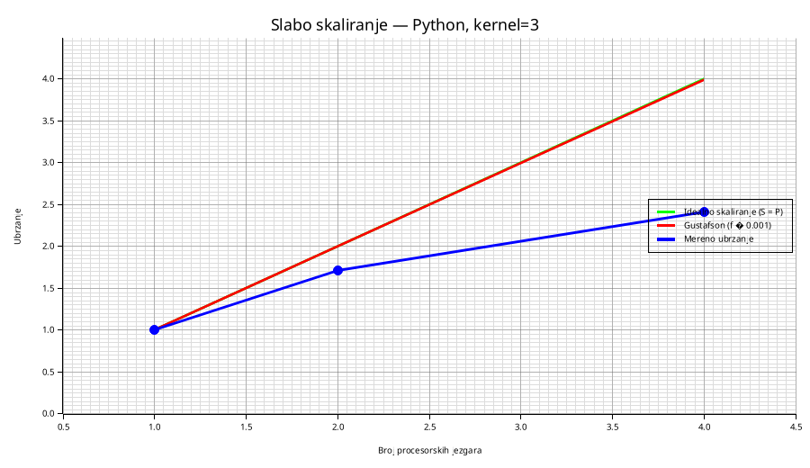
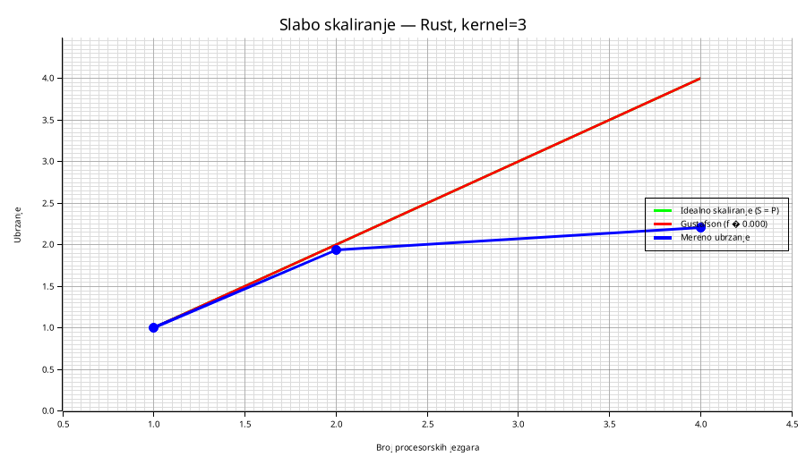

## Izveštaj: eksperimenti jakog i slabog skaliranja (KANNet blok)

### Kratak opis problema i implementacije
U okviru projekta implementiran je “konvoluciji sličan” blok zasnovan na ReLU‑KAN sloju (rad: `https://arxiv.org/abs/2406.02075`). Za svaku prostornu poziciju klizećeg prozora dimenzija \(n \times n\), odgovarajući pikseli ulaza se spljoštavaju u vektor \(x \in \mathbb{R}^{n^2}\), nad kojim se računa forward ReLU‑KAN sloja. Rezultat je izlazna tenzorska mapa dimenzija \((H_{out}, W_{out}, C_{out})\).

Implementirane su:
- **Python** sekvencijalna i multiprocessing paralelna verzija (tile‑ovi + halo).
- **Rust** sekvencijalna i thread paralelna verzija (tile‑ovi + halo).

Fokus eksperimenata je **analiza performansi** (HPC aspekti), a ne trening i tačnost.

---

## Tehnički detalji sistema (hardver + softver)

### Procesor i paralelni resursi
- **Model CPU**: 11th Gen Intel(R) Core(TM) i5‑1155G7 @ 2.50GHz  
- **Fizička jezgra / logička jezgra**: 4 / 8 (2 threada po jezgru)
- **Socket(s)**: 1
- **Frekvencije**: min 400 MHz, max ~4500 MHz (dinamičko skaliranje uključeno)
- **NUMA node-ovi**: 1 (node0 CPU(s): 0–7)

### Cache organizacija
- **L1d**: 192 KiB (4 instance)
- **L1i**: 128 KiB (4 instance)
- **L2**: 5 MiB (4 instance)
- **L3**: 8 MiB (1 instance)

### Memorija
- **RAM**: ~16 GB (vidljivo ~15.3 GB u NUMA izveštaju)
- **Swap**: 2.0 GB

### Operativni sistem i kernel
- **OS**: Ubuntu 25.10 (questing)
- **Kernel**: Linux 6.17.0-20-generic
- **Arhitektura**: x86_64

### Korišćeni alati i biblioteke
- **Python**: 3.11.7
- **NumPy**: 1.26.4
- **Rust**: rustc 1.92.0, cargo 1.92.0

### Ostale napomene koje utiču na rezultate
- Dinamičko skaliranje frekvencije CPU (turbo / powersave politike) može uticati na variaciju merenja.
- U Python paralelnoj implementaciji koristi se `multiprocessing` (procesi) zbog GIL-a.
- Merenja su rađena sa više uzoraka po tački (≈30) i analizom outlier‑a (Tukey).

---

## Metodologija merenja

### Opšti princip
Za svaku tačku eksperimenta (kombinaciju parametara) program se izvršava **oko 30 puta** (`runs=30`), i beleže se nezavisna vremena izvršavanja. Iz uzoraka se računaju:
- **srednja vrednost** vremena (mean)
- **standardna devijacija** (sample std, \(ddof=1\))
- **broj outlier‑a** po Tukey pravilu (1.5×IQR)

### Mereno vreme
Mere se sledeće komponente (za strong scaling):
- **Serijski/setup deo** \(t_{serial}\): učitavanje parametara + padding + računanje izlaznih dimenzija (konvolucioni “shape math”).
- **Sekvencijalno vreme** \(t_{seq}\): kompletno izvršavanje sekvencijalne verzije.
- **Paralelno vreme** \(t_{par}\): kompletno izvršavanje paralelne verzije.

U weak scaling eksperimentu dominantno se analizira \(t_{par}\) (paralelno vreme), pošto se problem povećava sa brojem jezgara.

### Parametri KANNet operatora
U svim eksperimentima navode se parametri:
- kernel \(n\), stride, padding
- broj izlaznih kanala \(C_{out}\)
- hiperparametri ReLU‑KAN: \(G\) i \(k\) (broj baza je \(G+k\))

U ovom izveštaju strong/weak scaling grafici fokusiraju se na **kernel=3**, stride=1, padding=0, \(C_{out}=8\), \(G=5\), \(k=3\), uz prostornu podelu na tile‑ove (`tiles_per_dim=2`).

---

## Eksperiment jakog skaliranja (Strong scaling)

### Definicija
Kod jakog skaliranja veličina problema je **fiksna**, a menja se broj procesorskih jezgara / radnika \(P\). Posmatra se:
- ostvareno ubrzanje:  
  \[
  S(P) = \frac{T(1)}{T(P)}
  \]
- efikasnost:  
  \[
  E(P) = \frac{S(P)}{P}
  \]

### Kako je eksperiment realizovan
- Ulazna matrica je fiksne dimenzije (npr. `input_matrix_128.csv` ili `input_matrix_512.csv`).
- Broj radnika \(P\) se menja (npr. `1,2,4`).
- U Python implementaciji radnici su **procesi** (`multiprocessing.Pool`), a u Rust implementaciji radnici su **niti** (`std::thread`).
- Paralelizacija je realizovana prostornom dekompozicijom izlaza na tile‑ove uz halo (tako da tile može nezavisno da se izračuna).

---

## Eksperiment slabog skaliranja (Weak scaling)

### Definicija
Kod slabog skaliranja cilj je da **posao po jezgru ostane približno konstantan**: kako raste broj jezgara \(P\), raste i veličina problema.

U ovom projektu veličina ulaza se podešava tako da važi približno:
- površina \(\propto P\)
- dimenzija \(\propto \sqrt{P}\)

Praktično, za baznu veličinu `weak_base` koristi se:
\[
N(P) = \mathrm{round}(weak\_base \cdot \sqrt{P})
\]
uz dodatno poravnanje na višekratnik 8 (radi konzistentnih dimenzija i dostupnih ulaznih fajlova).

### Kako se postiže “konstantan posao po jezgri”
Pošto je broj prozora klizećeg operatora približno proporcionalan \(H \cdot W\) (za fiksni kernel/stride/padding), povećanjem dimenzije matrice približno sa \(\sqrt{P}\) postiže se da ukupan broj prozora (posao) raste proporcionalno \(P\). Time je posao po radniku približno konstantan.

---

## Procena serijskog i paralelnog dela

### Serijska frakcija \(f\)
Serijska frakcija predstavlja deo vremena koji se po prirodi algoritma (ili implementacije) ne može paralelizovati.

U ovom projektu procena se radi na dva načina:
- **Merena procena** (konvolucioni “setup”):  
  \[
  f_{measured} \approx \frac{t_{serial}}{t_{seq}}
  \]
- **Fit procena preko Amdahl-a**: koristi se skup tačaka \((P, S_{measured}(P))\) i traži \(f\in[0,1]\) koji minimizuje grešku Amdahl modela (grid search).

### Paralelna frakcija
Paralelni deo je \(1-f\). U izveštaju se navode procene:
\[
f \cdot 100\\% \quad \text{(sekvencijalni deo)}, \qquad (1-f)\cdot 100\\% \quad \text{(paralelizabilni deo)}
\]

---

## Teorijski maksimumi ubrzanja

### Idealno skaliranje
Teorijski ideal je:
\[
S_{ideal}(P) = P
\]

### Amdahlov zakon (strong scaling)
\[
S_A(P) = \frac{1}{f + \frac{1-f}{P}}
\]
Očekivano: kriva se zasićuje kako \(P\) raste, zavisno od \(f\).

### Gustafsonov zakon (weak scaling)
Za isti parametar serijske frakcije \(f\):
\[
S_G(P) = P - f(P-1)
\]
Očekivano: za slabog skaliranja ubrzanje može rasti približnije idealnom čak i uz ne-nulti \(f\), jer se problem “uvećava” sa \(P\).

---

## Grafici i tabele (mesta za rezultate)

U nastavku su priloženi **bar 4 grafika** (x‑osa: broj jezgara, y‑osa: ostvareno ubrzanje), i za svaki grafik prateća tabela sa mean/std/outlier informacijama.
Eksperimenti su rađeni za `kernel=3`, `stride=1`, `padding=0`, `tiles_per_dim=2`, i radnike `P∈{1,2,4}`.

### Jako skaliranje — Python (Amdahl)
- **Grafik**: `outputs/plots_rust/kernel3/ntp_strong_python_amdahl_kernel3.png`

- **Tabela**: `outputs/scaling/kernel3/strong128/weakbase64/python_scaling_tables.md`
- **Mereno ubrzanje (mean)**: \(S(1)=0.919\), \(S(2)=1.465\), \(S(4)=1.602\)
- **Procena serijske frakcije**: \(f \approx t_{serial}/t_{seq} \approx 0.00150\) ⇒ ~0.150% serijski deo, ~99.850% paralelizabilni deo
- **Amdahl teorijski maksimum** (za gore navedeni \(f\)): \(S_A(2)\approx 1.997\), \(S_A(4)\approx 3.982\)

### Jako skaliranje — Rust (Amdahl)
- **Grafik**: `outputs/plots_rust/kernel3/ntp_strong_rust_amdahl_kernel3.png`

- **Tabela**: `outputs/scaling/kernel3/strong128/weakbase64/rust_scaling_tables.md`
- **Mereno ubrzanje (mean)**: \(S(1)=1.183\), \(S(2)=2.362\), \(S(4)=3.284\)
- **Procena serijske frakcije**: \(f \approx t_{serial}/t_{seq} \approx 0.000318\) ⇒ ~0.0318% serijski deo, ~99.968% paralelizabilni deo
- **Amdahl teorijski maksimum** (za gore navedeni \(f\)): \(S_A(2)\approx 1.999\), \(S_A(4)\approx 3.996\)

### Slabo skaliranje — Python (Gustafson)
- **Grafik**: `outputs/plots_rust/kernel3/ntp_weak_python_gustafson_kernel3.png`

- **Tabela**: `outputs/scaling/kernel3/strong128/weakbase64/python_scaling_tables.md` (sekcija “Slabo skaliranje”)
- **Kako je skaliran posao**: `weak_base=64`, a dimenzija ulaza se bira kao \(N(P)=round(64\sqrt{P})\), uz poravnanje na višekratnik 8 → \(N(1)=64\), \(N(2)=88\), \(N(4)=128\).
- **Gustafson teorijski maksimum** (za \(f\approx 0.00150\)): \(S_G(2)\approx 1.999\), \(S_G(4)\approx 3.996\)

### Slabo skaliranje — Rust (Gustafson)
- **Grafik**: `outputs/plots_rust/kernel3/ntp_weak_rust_gustafson_kernel3.png`

- **Tabela**: `outputs/scaling/kernel3/strong128/weakbase64/rust_scaling_tables.md` (sekcija “Slabo skaliranje”)
- **Kako je skaliran posao**: ista politika kao Python (da bi se koristili isti `input_matrix_{N}.csv` fajlovi).
- **Gustafson teorijski maksimum** (za \(f\approx 0.000318\)): \(S_G(2)\approx 2.000\), \(S_G(4)\approx 3.999\)

---

## Diskusija (mesta za interpretaciju)

U ovoj sekciji komentarišu se dobijeni rezultati (na ulazu 128×128, `kernel=3`):

- **Python strong scaling**: zabeleženo je da je \(S(1)<1\) (paralelna verzija sa jednim procesom je sporija od sekvencijalne), što je očekivano zbog overhead-a `multiprocessing` (fork/spawn, scheduling, prebacivanje tile-ova). Za \(P=2\) i \(P=4\) postoji ubrzanje, ali daleko od idealnog \(S=P\) zbog overhead-a i relativno malog problema.
- **Rust strong scaling**: ostvarena ubrzanja su znatno bliža idealnom (naročito do \(P=4\)), jer se koristi thread‑based paralelizacija, kompaktan `Vec<f32>` layout, i “streaming” KAN forward bez velikih alokacija.
- **Weak scaling**: i Python i Rust pokazuju rast vremena sa \(P\) (naročito u Python-u), što ukazuje da overhead paralelizacije i memorijski efekti rastu zajedno sa problemom; ideal weak scaling bi težio konstantnom vremenu.
- **Serijska frakcija \(f\)**: procene \(f\) dobijene iz \(t_{serial}/t_{seq}\) su vrlo male (<<1%), pa ograničenje po Amdahl-u nije dominantno; realna ograničenja dolaze od implementacionog overhead-a i memorijskih karakteristika (tile kopiranje/halo, scheduling, itd.).

---

## Reference
- ReLU‑KAN (arXiv:2406.02075): `https://arxiv.org/abs/2406.02075`
- Članak (strong/weak scaling + Amdahl/Gustafson): `https://www.kth.se/blogs/pdc/2018/11/scalability-strong-and-weak-scaling/`
 